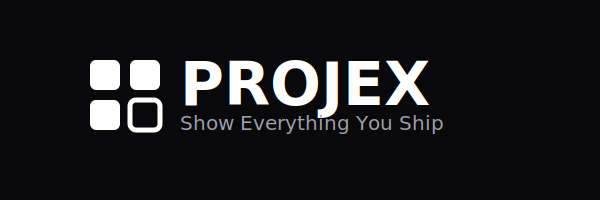

# Projex



Show Everything You Ship

A shadcn-style component library for building developer portfolio pages. Drop in pre-built project cards that auto-fetch data from GitHub, npm, and Product Hunt — no API glue required. Built for Next.js. Zero CSS shipped by default.

**Open-source (MIT licensed) and free to use.**

[Full Documentation →](https://projex.manningworks.dev)

## Why Projex?

Every developer eventually builds a projects page, and almost every developer builds it from scratch. They wire up GitHub APIs, handle rate limiting, design cards, handle edge cases for private repos and non-GitHub projects, and end up with bespoke solutions that help nobody else.

**Projex solves this by:**

- **Auto-discover GitHub repos** — Run `npx @manningworks/projex init --github` and get all your public repos pre-configured
- **Zero runtime API calls** — All data fetched at build time. No rate limits at runtime, fresh data on every rebuild
- **Mix project types** — GitHub, npm, Product Hunt, YouTube, Gumroad, manual work — all in one place
- **Copy-paste components** — You own the code. Customize, refactor, or extend anything
- **Style with data attributes** — Target `[data-projex-card]` or use pre-built themes

## Who is Projex for?

**OSS maintainers** — Auto-detect all your GitHub repositories with `npx @manningworks/projex init --github`. Stars, forks, and language data populate automatically.

**Freelancers** — Showcase client work with manual projects. Full control over descriptions, tags, and links. Mix with GitHub repos for open source contributions.

**SaaS founders** — Display Product Hunt launches with upvotes and comments. Track multiple products in one place.

**Junior developers** — Build your first portfolio with npm packages and personal projects. Start small, scale as you grow.

**Solo entrepreneurs** — Mix GitHub, npm, Product Hunt, and manual projects. One config for everything you ship.

## Quick Start

```bash
# Auto-discover your GitHub repos
npx @manningworks/projex init --github

# Add components to your project
npx @manningworks/projex add project-card

# Add a pre-built theme
npx @manningworks/projex add theme-minimal
```

```tsx
import { ProjectCard } from '@manningworks/projex'
import { projects } from './projex.config'

export function ProjectsGrid() {
  return (
    <div>
      {projects.map((project) => (
        <ProjectCard key={project.id}>
          <ProjectCard.Header project={project} />
          <ProjectCard.Description project={project} />
          <ProjectCard.Stats project={project} />
          <ProjectCard.Links project={project} />
        </ProjectCard>
      ))}
    </div>
  )
}
```

## CLI

```bash
# Initialize with auto GitHub discovery
npx @manningworks/projex init --github

# Copy components to your project
npx @manningworks/projex add project-card
npx @manningworks/projex add project-view

# Add pre-built themes
npx @manningworks/projex add theme-minimal
npx @manningworks/projex add theme-dark
npx @manningworks/projex add theme-gradient

# List all projects
npx @manningworks/projex list

# Edit a project
npx @manningworks/projex edit project my-project --status shipped --featured

# Remove a project
npx @manningworks/projex remove project old-project --force
```

The CLI automatically installs the `@manningworks/projex` package as a dependency, and copied components import types directly from it.

## Documentation

- [Full Documentation](https://projex.manningworks.dev)
- [Getting Started Tutorial](https://projex.manningworks.dev/guides/getting-started)
- [Real World Examples](https://projex.manningworks.dev/guides/real-world-examples)
- [Component Reference](https://projex.manningworks.dev/api/components/)
- [CLI Reference](https://projex.manningworks.dev/cli)

## Project Types

Projex supports multiple project types out of the box:

- **GitHub** — Auto-fetch stars, forks, language, topics
- **npm** — Display downloads, version, package info
- **Product Hunt** — Show upvotes, comments, launch date
- **YouTube** — Show subscribers, views, latest video
- **Gumroad** — Display revenue, sales, subscribers
- **Manual** — Full control over client work, side projects
- **Hybrid** — Mix GitHub + npm, or any combination

**Additional types:** Lemon Squeezy (store data), Dev.to (articles)
[View full documentation →](https://projex.manningworks.dev/guides/project-types)

## Styling

Projex ships with zero styling. Use the data attributes to style components however you want, or grab a pre-built theme:

```css
/* Target any element */
[data-projex-card] {
  border: 1px solid #e5e5e5;
  border-radius: 8px;
  padding: 1rem;
}

/* Target specific states */
[data-projex-status-value="active"] {
  background: #10b981;
  color: white;
}
```

## Contributing

Projex is in active development. We welcome contributions from experienced developers who understand the shadcn philosophy: own your code, use good defaults, avoid opinions.

Check the [AGENTS.md](./AGENTS.md) for development guidelines.

## License

MIT
